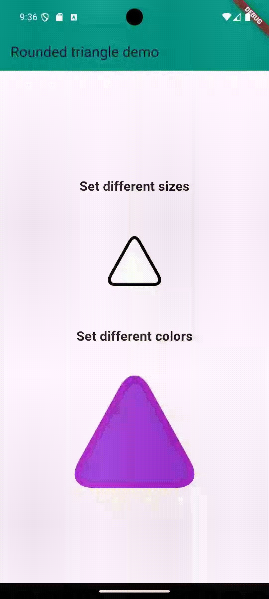

<!--
This README describes the package. If you publish this package to pub.dev,
this README's contents appear on the landing page for your package.

For information about how to write a good package README, see the guide for
[writing package pages](https://dart.dev/guides/libraries/writing-package-pages).

For general information about developing packages, see the Dart guide for
[creating packages](https://dart.dev/guides/libraries/create-library-packages)
and the Flutter guide for
[developing packages and plugins](https://flutter.dev/developing-packages).
-->

A triangle widget with rounded edges that can be customised in size and fill/border colours.

## Demo



## Getting started

RoundedTriangle depends on the following:\
-[Flutter material component widgets](https://docs.flutter.dev/ui/widgets/material)\
-[Dart math library](https://api.dart.dev/stable/3.5.0/dart-math/dart-math-library.html)

## Usage

To use, insert RoundedTriangle() into your widget tree. A working example is found in the example directory's [main.dart](example/lib/main.dart) file

```dart
RoundedTriangle(
  fillColor: Colors.white, // [Optional] Defaults to package:flutter/src/material/colors "white"
  borderColor: Colors.black, // [Optional] Border will only be visible if a colour is provided
  iconSize: 200, // [Optional] Defaults to 48
)
```
